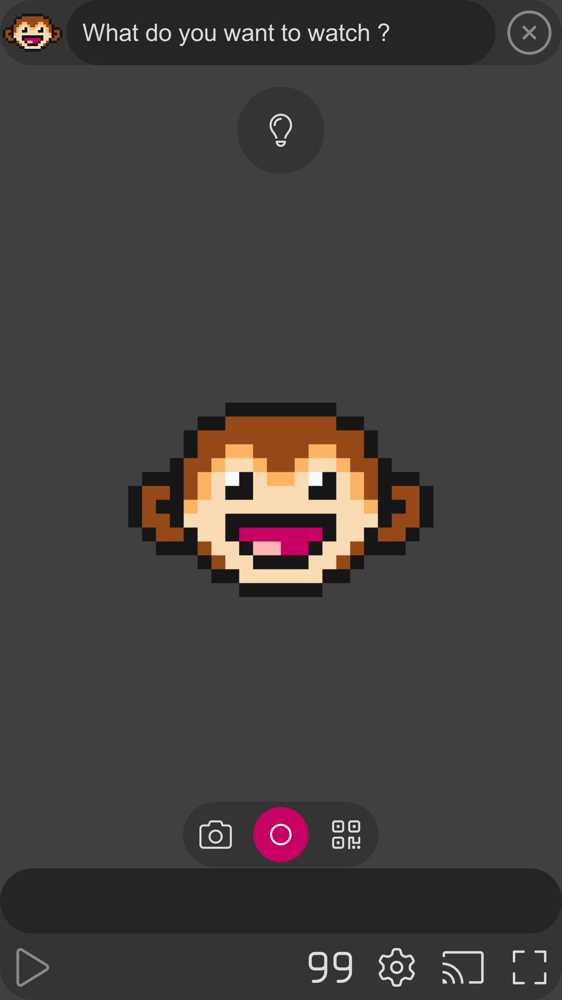

## english / [français](../fr/consulting/README.md)

## Mission statement

Our mission is to bootstrap your multimedia applications on all platforms.

We achieve this through our state of the art application kit called Sky kit along with our
practical experience on the field for more than 10 years.

## We build powerful applications

In the last few years, we've been revamping the most popular video player, used by millions: 
[VLC media player](https://www.videolan.org). We're specialized in application production covering
mainstream multimedia use cases all the way to the most advanced streaming technologies with
applications like [MotionMonkey](https://omega.gg/MotionMonkey) or [tevolution](https://omega.gg/tevolution).

We make it powerful and we make it beautiful: from the first line to the last pixel.

## We rely on state of the art technology

[Sky kit](https://omega.gg/Sky) is a comprehensive and open source application kit
specifically built for high performance multimedia applications. It's based on the Qt framework
and comes with an integrated VLC streaming engine.

It supports 5 platforms from a single C / C++ / QML codebase and provides dynamic UX / UI while
adapting to the different hardware and interactions. It's a solid technical proposition that
retains a strong versatility.

Given its multimedia parti pris it makes application production efficient while scaling beautifully
on each platform. It produces native and multiplatform applications from a single codebase: there's
currently no equivalent to this in the multimedia field.

Supported libraries:
- Qt5 and Qt6
- libVLC 3.x and libVLC 4.x

## We deploy everywhere from a single codebase

Application development is nothing if you can't succesfully deploy on each platform you're
targeting. We ensure that everything looks great no matter where it runs and automate the
deployment process through an Azure based continuous integration. We hold your hand until the
application runs on concrete hardware inside your very own hands.

Supported platforms:
- [Windows](https://en.wikipedia.org/wiki/Microsoft_Windows)
- [macOS](https://en.wikipedia.org/wiki/MacOS)
- [Linux](https://en.wikipedia.org/wiki/Linux)
- [iOS](https://en.wikipedia.org/wiki/IOS) and [Apple TV](https://en.wikipedia.org/wiki/Apple_TV)
- [Android](https://en.wikipedia.org/wiki/Android) and [Android TV](https://en.wikipedia.org/wiki/Android_TV)

## We publish your application on all major marketplaces

Deploying is not enough, you need to reach the gates of the different marketplaces. That's not an
easy task when it comes to streaming applications but we know our ways to succesful application
publishing. When we deliver an application it will be published for testers and ready to publish
for everyone.

Supported marketplaces:
- [Microsoft store](https://apps.microsoft.com)
- [App Store](https://www.apple.com/app-store)
- [Google Play](https://play.google.com)
- [Steam](https://store.steampowered.com) (on a limited range of applications)
- [itch.io](https://itch.io)

## Our services

### Bootstrap your brand new multimedia application

We start from your requirements and concept for your multimedia application. From here we can take
your existing design or provide our own and discuss what's best for the project. Then we implement
the application on solid grounds with Sky kit, the Qt application framework and our libVLC video
renderer. We're often able to deploy within days for testing on concrete hardware. Then we
push your signed application on the different marketplaces and get it ready for prime time.

We want to ensure that you build your project on solid ground and put you in a position to iterate
and improve the existing codebase while retaining solid foundations during the entire lifecycle of
the application. That approach is quite unique in our field.

### Revamp your existing application with state of the art technology

You have an existing multimedia application that has become hard to maintain and dated in terms of
UI / UX and you want to retain the existing codebase while transitioning to something new: we are
here to help. We take the existing application and its implementation and port it with the Sky
application kit based on the Qt framework and a state of the art libVLC video renderer. 

We'll work in tandem to rewrite and remaster your application while preserving functionalities and
reaching new grounds in terms of performances and supported platforms. That's precisely what we did
for our revamping of the upcoming VLC 4.x on desktop.

### Clone and port your existing application to new platforms

You have an existing multimedia application that works very well on a given platform and you would
like to bring it to new platforms. Yet, given its current implementation you're not sure how to
port the existing codebase and deploy it to these new grounds with different hardware and
requirements in terms of UI / UX. 

We'll clone and port your application while retaining the specific functionalities of your current
application. That way you can explore new platforms while keeping your existing application for a
specific hardware / platform scenario.

As a second step, you might consider moving everything on the same codebase. Effectively pushing
your application on multiple platforms from a single codebase. This will give you a substantial
advantage in terms of efficiency and maintenability.

### Custom request for your multimedia application

Maybe you have a specific request for a multimedia application that requires a dedicated workflow.
We're ready to discuss your project and potentially partner with the best players in our field like
[Videolabs](https://videolabs.io) or [FFmpeg](https://www.ffmpeg.org) to provide taylor made
adjustements on low level behaviors all the way to custom UI / UX for your specific needs.

Just contact us and let's have a chat about it.

## We work with fantastic partners

Our current partners are the following:
- VideoLAN: https://www.videolan.org
- Videolabs: https://videolabs.io
- FFmpeg: https://www.ffmpeg.org
- Qt Group: https://www.qt.io

## Software references

We've contributed on or built the following applications:
- VLC media player: https://www.videolan.org
- MotionMonkey: https://omega.gg/MotionMonkey
- MotionBox: https://omega.gg/MotionBox
- tevolution: https://omega.gg/tevolution

## Contact us

[contact@omega.gg](mailto:contact@omega.gg)
