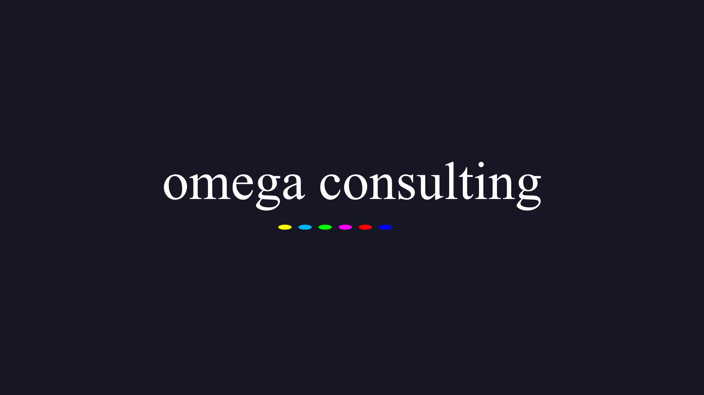

## english / [français](../fr/consulting/README.md)

## Mission statement

Our mission is to bootstrap your multimedia applications on all platforms.

We achieve this through our state of the art application kit called Sky kit along with our
practical experience on the field for more than 10 years.

## We build powerful applications

In the last few years, we've been revamping the most popular video player, used by millions: 
[VLC media player](https://www.videolan.org). We're specialized in application production covering
mainstream multimedia use cases all the way to the most advanced streaming technologies with
applications like [MotionMonkey](https://omega.gg/MotionMonkey) or [tevolution](https://omega.gg/tevolution).

We make it powerful and we make it beautiful: from the first line to the last pixel.

## We rely on state of the art technology

[Sky kit](https://omega.gg/Sky) is a comprehensive and open source application kit
specifically built for high performance multimedia applications. It's based on the Qt framework
and comes with an integrated VLC streaming engine.

It supports 5 platforms from a single C / C++ / QML codebase and provides dynamic UX / UI while
adapting to the different hardware and interactions. It's a solid technical proposition that
retains a strong versatility.

Given its multimedia parti pris it makes application production efficient while scaling beautifully
on each platform. It produces native and multiplatform applications from a single codebase: there's
currently no equivalent to this in the multimedia field.

Supported libraries:
- Qt5 and Qt6
- libVLC 3.x and libVLC 4.x

## We deploy everywhere from a single codebase

Application development is nothing if you can't succesfully deploy on each platform you're
targeting. We ensure that everything looks great no matter where it runs and automate the
deployment process through an Azure based continuous integration. We hold your hand until the
application runs on concrete hardware inside your very own hands.

Supported platforms:
- Windows
- macOS
- Linux
- iOS and Apple TV
- Android and Android TV

## We publish your application on all major marketplaces

Deploying is not enough, you need to reach the gates of the different marketplaces. That's not an
easy task when it comes to streaming applications but we know our ways to succesful application
publishing. When we deliver an application it will be published for testers and ready to publish
for everyone.

Supported marketplaces:
- Microsoft store
- App Store
- Google Play
- Steam (on a limited range of applications)
- itch.io

## Our services

### Bootstrap your brand new multimedia application

### Revamp your existing application with state of the art technology

### Clone and port your existing application to new platforms

### Custom request for your multimedia application

## We work with fantastic partners

Our current partners are the following:
- VideoLAN: https://www.videolan.org
- Videolabs: https://videolabs.io
- FFmpeg: https://www.ffmpeg.org
- Qt Group: https://www.qt.io

## Software references

We've contributed on or built the following applications:
- VLC media player: https://www.videolan.org
- MotionMonkey: https://omega.gg/MotionMonkey
- MotionBox: https://omega.gg/MotionBox
- tevolution: https://omega.gg/tevolution

## Contact us

[contact@omega.gg](mailto:contact@omega.gg)
